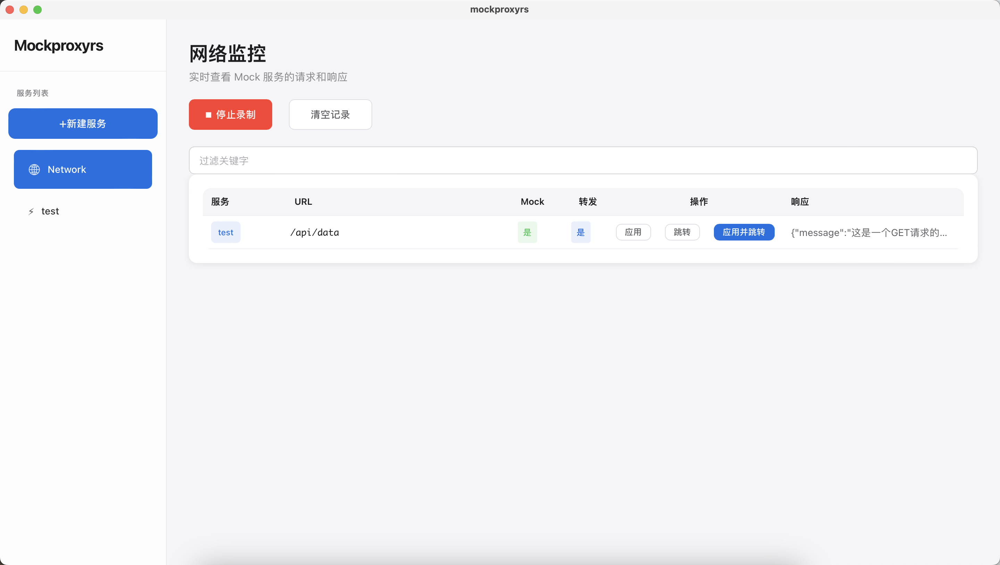
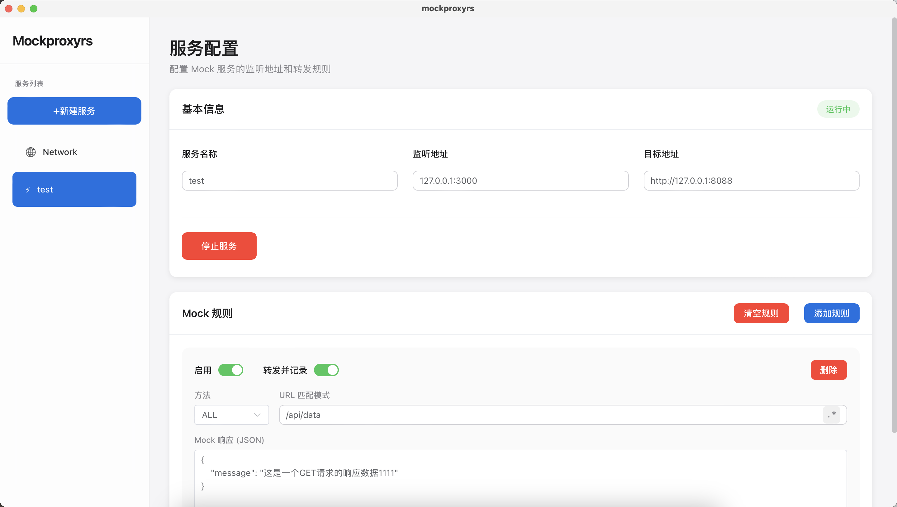

# Mockproxyrs

一个轻量级的反向代理和 Mock 服务工具，帮助开发者快速搭建 API 模拟环境。

## 项目简介

Mockproxyrs 是一个跨平台的代理与 Mock 工具，采用模块化架构设计，目前仅支持桌面应用。核心功能使用 Rust 编写，确保高性能和内存安全。

### 应用截图






### 主要特性

- **反向代理** - 将请求转发到目标服务器
- **Mock 服务** - 根据规则返回自定义响应，无需真实后端
- **规则匹配** - 支持路径、方法、多维度匹配
- **事件驱动** - 实时查看请求/响应事件流
- **数据持久化** - 使用 SQLite 存储 Mock 规则和配置

## 项目结构

```
mockproxyrs/
├── core/           # 核心库 (Rust)
│   ├── domain/     # 领域模型 (Mock规则、代理配置)
│   ├── proxy/      # 代理服务器以及mock实现
│   ├── event/      # 事件系统
│   └── repository/ # 数据存储层
├── desktop/        # 桌面应用 (Tauri 2)
├── server/         # 独立服务器 (计划中)
└── web/            # Web 前端 (Vue 3)
```

## 技术栈

### 后端/核心
- **Rust** - 系统编程语言
- **Tokio** - 异步运行时
- **Hyper** - HTTP 服务器/客户端
- **SQLite** - 数据持久化

### 桌面应用
- **Tauri 2** - 跨平台桌面框架
- **Rust** - 原生后端

### Web 前端
- **Vue 3** - 渐进式 JavaScript 框架
- **TypeScript** - 类型安全
- **Element Plus** - UI 组件库
- **Pinia** - 状态管理
- **Vite** - 构建工具

## 快速开始

### 安装后运行环境
- Windows 10+ /macOS 10.15+ / 主流 Linux 发行版
- Windows 需预装或自动安装 WebView2 Runtime
- 无需额外数据库、运行时环境

### 环境要求

- Rust 1.70+
- Node.js 18+
- npm 或 pnpm

### 安装依赖

```bash
# 安装 Rust 依赖

# 安装 Web 前端依赖
cd web && npm install

# 安装桌面应用依赖
cd desktop && npm install
```

### 开发模式

```bash
# 启动桌面应用 (开发模式)
cd desktop
npm run tauri dev
```

这将同时启动：
- Vite 开发服务器 (http://localhost:1420)
- Tauri 桌面窗口

### 构建

```bash
# 构建桌面应用
cd desktop
npm run tauri build
```

构建产物位于 `desktop/src-tauri/target/release/bundle/` 目录。

## 核心模块说明

### core - 核心库

平台无关的核心功能实现，采用领域驱动设计：

**domain - 领域模型**
- `MockService` - Mock 服务配置，定义监听地址和目标地址
- `MockServiceDetail` - 服务详情，包含运行状态
- `MockRule` - Mock 规则，支持 URL 模式、正则匹配、启用/禁用、转发记录等
- `ServiceStatus` - 服务运行状态
- `ResponseEvent` - 响应事件，用于推送到前端展示

**proxy - 代理服务器**
- `ProxyServer` - HTTP 代理服务器，处理请求转发和 Mock 响应
- `RuleMatcher` - 规则匹配器，根据 URL 匹配 Mock 规则
- `UpstreamClient` - 上游客户端，负责转发请求到目标服务器，支持http、https

**event - 事件系统**
- `EventEmitter` - 事件发射器 trait，由不同平台实现
- `NoopEmitter` - 空实现，用于测试或不需要事件推送的场景

**repository - 数据存储**
- `MockRepository` - 数据仓库 trait，定义服务与规则的 CRUD 接口
- `SqliteRepository` - SQLite 实现，支持数据持久化

### desktop - 桌面应用

基于 Tauri 2 的跨平台桌面应用：

- 支持 macOS、Windows、Linux
- 原生系统集成

### web - Web 前端

Vue 3 单页应用：

- 响应式界面设计
- Mock 规则可视化管理
- 实时请求监控，支持一键新增、更新规则

## 功能配置说明

### 代理配置

代理服务支持以下配置项：

服务名称：用于区分
监听地址：代理服务的监听地址
目标地址：代理服务器监听后转发的目标地址


### Mock 规则
启用：是否启用规则，启用状态将返回mock响应，未启用直接请求目标地址并返回
转发并记录：启用状态下，开关打开将请求目标地址并记录真实响应然后返回mock响应
方法：请求方法get、post等
url匹配模式：路径，可含参数如：/api/data；开启正则模式则填写正则表达式
mock响应：启用状态将返回mock响应

Mock 规则支持多种匹配方式：
按优先级排序：
1. 非正则模式路径全匹配+请求方法匹配
2. 非正则模式路径全匹配+请求方法规则为All
3. 非正则模式url（含参数）全匹配+请求方法匹配
4. 非正则模式url（含参数）全匹配+请求方法规则为All
5. 正则模式全匹配+请求方法匹配
6. 正则模式全匹配+请求方法为All

### 网络监控
录制功能将记录经过代理服务的真实响应以及mock响应。
1. 若有真实响应，应用按钮可以新增规则、更新规则，将规则mock响应设置为本次真实响应
2. 若有匹配中规则可以直接跳转到规则页

## 开发指南

### 代码规范

- Rust 代码遵循 `cargo fmt` 格式化标准
- TypeScript/Vue 代码使用项目配置的 ESLint 规则

## 许可证

[Apache License 2.0](LICENSE)

## 贡献

欢迎提交 Issue 和 Pull Request！

## 作者

mazao
